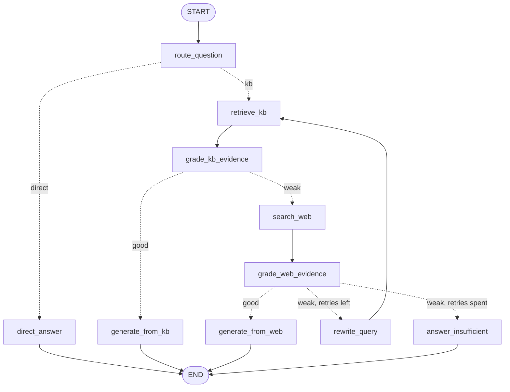

# Enterprise HR Policy and Employee Support — Agentic RAG Copilot

An internal HR assistant built as an **agentic** retrieval-augmented generation system: instead of
answering from a single retrieval pass, it scores what it retrieves, rejects out-of-domain matches,
and is designed to fall back to query rewriting and web search rather than hallucinate policy.

Built as a Forward Deployed Engineer (FDE) style project — taking a RAG workflow from notebook
experiment to a measured, reproducible ingestion and retrieval layer.

---

## Status

| Layer | State |
|---|---|
| Public web ingestion → Pinecone | Implemented, verified end to end |
| Private (internal) knowledge base → Pinecone | Implemented, verified end to end |
| Namespace isolation between the two corpora | Implemented |
| Retrieval + out-of-domain gating | Implemented, evaluated on 12 questions |
| Groq LLM client (`openai/gpt-oss-20b`, temperature 0) | Implemented, live call verified |
| Tavily web-search client | Implemented, live call verified |
| Structured routing + evidence grading | Implemented, 21/21 on a labelled set |
| LangGraph agent (10 nodes: route → grade → rewrite → fallback → answer) | Implemented, all paths verified |
| FastAPI service | Not yet built |
| HTML/CSS/JS frontend | Not yet built |

The agent graph is complete and runs end to end. What remains is exposing it over HTTP and
putting a UI in front of it.

## The agent graph

Ten nodes in [Rag/graph.py](Rag/graph.py). The graph never answers from model memory: every
answer is traceable to internal policy, to cited web results, or to an explicit admission that
neither had the evidence.



Dotted arrows are branches taken on a structured decision. Regenerate the diagram straight from
the compiled graph with `python Rag/graph.py --diagram`, which writes
[docs/agent-graph.md](docs/agent-graph.md); a structural test asserts the compiled edge set matches
this design exactly, so the picture cannot drift from the code.

**A rewrite loops back to the KB, not to web search.** A weak retrieval is usually a vocabulary
mismatch between how an employee phrases a question and how policy is written, so the rewritten
query deserves another look at internal policy before falling back to public sources. `retry_count`
bounds the loop at `MAX_RETRIES = 1`.

Verified live, all four terminal paths plus the loop:

| Path | Result |
|---|---|
| `"hi there"` | `direct` |
| `"How many PTO days do I get per year?"` | `private_kb`, answers 20 days, cites the source file |
| `"Who won the football World Cup in 2022?"` | KB returns 0 chunks → `web_search`, flagged as public info, not policy |
| KB and web both empty (injected) | one rewrite, then `insufficient_evidence`; loop terminates |
| KB empty then populated (injected) | recovers to `private_kb` after the rewrite |

---

## Architecture

```
                    ┌──────────────────────────────┐
  public web  ───►  │  WebBaseLoader (scoped to    │
  (HR Acuity)       │  .entry-content)             │
                    └───────────────┬──────────────┘
                                    │
  data/private_kb/*.md  ───►  RecursiveCharacterTextSplitter
  (6 internal policies)             │  1000 chars / 150 overlap
                                    ▼
                    ┌──────────────────────────────┐
                    │  all-MiniLM-L6-v2 (384-d,    │
                    │  normalized, runs locally)   │
                    └───────────────┬──────────────┘
                                    ▼
                    ┌──────────────────────────────┐
                    │  Pinecone serverless, cosine │
                    │   namespace ""          → 18 │  public article
                    │   namespace "private-kb"→ 15 │  internal policy
                    └───────────────┬──────────────┘
                                    ▼
                     retriever + raw-cosine gate (0.15)
                                    │
                    ┌───────────────┴──────────────┐
                    │                              │
             chunks returned                 empty result
             → grade & answer          → rewrite / web search
```

**Two corpora, one index, separated by namespace.** Scraped public content and internal policy are
never interleaved in a single retrieval result. Retrieval against the private KB is scoped to the
`private-kb` namespace.

**Embeddings run locally.** `all-MiniLM-L6-v2` via `sentence-transformers` — no per-query embedding
cost and no employee question leaving the machine at embed time.

---

## Retrieval evaluation

Retrieval quality is measured, not assumed. A 12-question benchmark covers all six private
documents plus deliberately out-of-domain questions.

| Metric | Result |
|---|---|
| In-domain questions | 10 |
| Top-1 retrieved from correct source document | **10 / 10** |
| Out-of-domain questions | 2 |
| Out-of-domain correctly returning zero documents | **2 / 2** |

### Choosing the threshold

The gate was calibrated from the measured score distribution rather than guessed:

| Score population | n | min | median | max |
|---|---|---|---|---|
| Chunks from the correct source document | 21 | 0.171 | 0.420 | 0.663 |
| Chunks from a wrong source document | 19 | 0.074 | 0.258 | 0.521 |
| Out-of-domain, best match | 2 | 0.005 | — | 0.099 |

Out-of-domain peaks at **0.099**; the weakest correct chunk scores **0.171**. A raw-cosine gate at
**0.15** sits in that gap — it drops every out-of-domain result without losing a single in-domain
top-1.

**The gate is an out-of-domain filter, not a relevance grader.** Wrong-document chunks scored as
high as 0.521, overlapping the correct-document range, so no threshold can separate them. Judging
whether retrieved text actually answers the question stays the LLM grader's job in the agent graph.
The threshold exists to stop obvious noise from reaching it.

---

## Structured decisions

The graph branches on LLM decisions, so those decisions are Pydantic models bound with
`with_structured_output` rather than parsed out of prose. Two decisions exist today, in
[Rag/schemas.py](Rag/schemas.py):

| Decision | Values | Purpose |
|---|---|---|
| `RouteDecision.route` | `kb` / `direct` | Does this message need a policy lookup at all? |
| `EvidenceGrade.grade` | `good` / `weak` | Can the retrieved evidence actually answer the question? |

Measured on a labelled set: **router 16/16, grader 7/7.** The router set covers greetings and
questions about the assistant itself (`direct`) alongside policy questions and external factual
questions (`kb`) — both classes matter, because a prompt tightened for one loosens the other.

The grader's value is in the near misses. It correctly returns `weak` for *"What is the mileage
reimbursement rate per kilometre?"* — the evidence comes from the right document, the expense
policy, but that policy never states a rate. It also rejects *"What is the dental waiting period
for contractors?"*, where the benefits document covers employees only.

**The similarity gate and the grader do different jobs.** The 0.15 cosine gate rejects out-of-domain
*questions* before an LLM call is spent; the grader rejects *irrelevant evidence* for questions that
are in domain. "What is the capital of France?" is stopped by the gate and never reaches the grader.
A fabricated *"quokka grooming sabbatical"* question clears the gate — it looks lexically like leave
policy — and is caught by the grader. Removing either leaves a gap.

## Setup

Requires Python 3.13 and a Pinecone account. Embeddings run locally, so the first run downloads
`sentence-transformers` and PyTorch (~2.5 GB).

```bash
python -m venv hr
hr\Scripts\activate
pip install -r req.txt
```

Copy [.env.example](.env.example) to `.env` and fill in your keys:

```bash
cp .env.example .env
```

`.env` is gitignored and has never been committed. The Pinecone index is created automatically on
first run (384-d, cosine, serverless).

## Running

```bash
python Rag/Agentic_rag.py     # ingest the public HR article  -> default namespace
python Rag/private_kb.py      # ingest the private KB + retrieval demo -> "private-kb"
python Rag/graph.py           # run the agent over sample questions
python Rag/demo.py            # four demos, one per path
python Rag/demo.py 2          # just demo 2
```

Ask a single question:

```python
from Rag.graph import ask_agent, build_graph

graph = build_graph()                     # reuse across questions
result = ask_agent("How many PTO days do I get per year?", graph)
```

`ask_agent` prints the answer with its provenance — route taken, source used, retry count, how
much evidence each stage found and how it graded, and which KB files were cited — then returns the
final state. Use `ask()` instead when you want the state without the printing.

### Demos

```
Demo 1  Answer from the Private KB   "How many PTO days do I get, and do unused days carry over?"
Demo 2  Web Search Fallback          "What is the statutory minimum paid holiday in the UK?"
Demo 3  Direct Answer                "hi there, thanks for the help earlier!"
Demo 4  Current / External Question  "What does recent research say about four-day work weeks?"
```

| Demo | route | source_used | retries |
|---|---|---|---|
| 1 | `kb` | `private_kb` | 0 |
| 2 | `kb` | `web_search` | 0 |
| 3 | `direct` | `direct` | 0 |
| 4 | `kb` | `web_search` | 0 |

Demos 2 and 4 both end at web search, and the difference is the point. Demo 2 is a genuine HR
question this company's KB does not cover; demo 4 is one no internal policy could ever answer. In
both, retrieval returns four chunks that *look* plausible and the grader marks them `weak` — the
similarity gate alone would have let them through.

Both ingests are idempotent — chunk ids are derived from `source` + `start_index`, so re-running
overwrites rather than duplicating.

## Repository layout

Layered so both corpora share one implementation. Each layer imports only from those above it.

```
Rag/config.py         settings, secrets, tunable constants (no heavy imports)
Rag/clients.py        embeddings (cached), Groq chat model, Tavily search
Rag/loaders.py        web + markdown loading, chunking, chunk ids, evidence rendering
Rag/vectorstore.py    Pinecone index management and retrieval, parameterised by namespace
Rag/schemas.py        structured routing/grading decisions, AgentState
Rag/graph.py          the 10-node LangGraph agent + diagram rendering
docs/agent-graph.md   diagram generated from the compiled graph

Rag/Agentic_rag.py    entry point: public web corpus
Rag/private_kb.py     entry point: private KB

data/private_kb/*.md  six internal HR policy documents
req.txt               pinned dependencies
CLAUDE.md             architecture notes and non-obvious constraints
```

The two corpora differ only in where text comes from, which separators split it, and which
namespace it lands in. Ingest, freshness waiting, orphan pruning, gating and retrieval are one
implementation taking a namespace argument.

---

## Engineering decisions and problems solved

Notes kept because each of these failed silently rather than raising an error.

**Scoped the loader to the article body.** `WebBaseLoader` over the full page ingested navigation,
related-post cards and footer boilerplate — 18,520 characters, roughly 20% junk. Restricting
extraction to the article container cut it to 14,803 characters of real policy text.

**BeautifulSoup matches the whole class attribute.** `SoupStrainer(class_="entry-content")` silently
matched nothing, because the element's attribute is `"entry-content section-padding relative ..."`.
A callable matcher that splits the attribute into tokens fixed it. An explicit guard now raises if
extraction yields zero text, so a future layout change fails loudly instead of indexing nothing.

**LangChain's `score_threshold` is not on the cosine scale.** It maps raw cosine `c` to `(c + 1) / 2`.
Passing a raw cosine straight through filters nothing — `0.15` is read as raw cosine `−0.70`, which
nothing falls below. The conversion is now explicit so callers reason in raw cosine, the same scale
the debugging output prints.

**Pinecone serverless is eventually consistent.** A retrieval issued immediately after an upsert
returns an empty list. Ingestion polls `describe_index_stats` until the written vectors are actually
queryable before returning.

**A namespace typo fails silently.** The upsert succeeds and every subsequent retrieval returns `[]`.
Writer and reader share a single `PRIVATE_NAMESPACE` constant so the two cannot drift.

**Ingestion was not idempotent.** `PineconeVectorStore.from_documents` mints fresh UUIDs per call, so
every re-run doubled the corpus. Deterministic ids from `source` + `start_index` make re-ingestion an
overwrite — verified by two consecutive runs both leaving 18 vectors.

**Any single service outage took down the whole agent.** Six nodes called Pinecone, Tavily or the
LLM with no error handling, so one flaky call aborted the run — worst of all in `search_web`, which
*is* the fallback and had none of its own. Every node now degrades instead of raising: retrieval
failure becomes zero chunks and routes to the web, search failure becomes empty evidence, a failed
rewrite keeps the original query, and a failed generation returns an honest message rather than
nothing. Verified by injecting failures at each node and asserting the run still terminates with an
answer.

**An exhausted API quota was indistinguishable from a knowledge gap.** Groq's free tier caps tokens
per *day*. When it ran out mid-testing, every grade came back `weak` and every run ended
`insufficient_evidence` — the safe defaults working correctly, but silently. Rate-limit rejections
are now detected and logged at ERROR as degraded results rather than judgements.

**The embedding model was reloaded on every call.** `get_embeddings()` was uncached, so any
retrieval that did not pass an explicit `embedding` rebuilt a ~90 MB sentence-transformers model
from disk. Harmless in a script that passes one through; ruinous in a request handler that
retrieves per turn. Now `lru_cache`d and verified to return the same instance.

**The two corpora had two parallel implementations.** Ingest, chunking, freshness waiting and
retrieval were written twice — once for the public article, once for the private KB — and had
already drifted: the public path had no eventual-consistency wait and no orphan pruning, both of
which the private path needed. They are now one namespace-parameterised implementation in
`vectorstore.py`, so a fix lands in both places at once.

**Upsert-only ingestion served withdrawn policy.** Re-ingesting updates and adds vectors but never
removes them, so deleting a policy document left its vectors in the index still answering employee
questions. Ingestion now reconciles: it lists the namespace and deletes vectors with no
corresponding chunk on disk. Verified by adding a temp policy (retrievable at 0.853), deleting the
file, re-ingesting, and confirming it no longer retrieves.

**Package imports were broken.** `from Rag.private_kb import ...` raised `ModuleNotFoundError`
because the module used a script-relative import — fine when run directly, fatal for the planned
FastAPI and LangGraph layers. `Rag/` is now a package and imports work both ways.

**Import-time side effects removed.** Documents, chunks and embeddings were built at module scope, so
importing the module performed an HTTP fetch and loaded a model. Moved into `main()` so the module can
be imported by the planned FastAPI and LangGraph layers without doing work.

**Unbounded readiness loop bounded.** Waiting for index readiness had no timeout and could hang
forever; it is now capped and raises.

---

## Roadmap

1. FastAPI service exposing the graph
2. Web frontend
3. Expand the private KB beyond markdown — `pypdf` and `python-docx` are already pinned
4. Conversation memory, so follow-up questions resolve against the previous turn

## Tech stack

Python 3.13 · LangChain · LangGraph · Pinecone serverless · sentence-transformers
(all-MiniLM-L6-v2) · Groq (`openai/gpt-oss-20b`) · Tavily · Pydantic · BeautifulSoup ·
FastAPI *(planned)*

## License

See [LICENSE](LICENSE).
