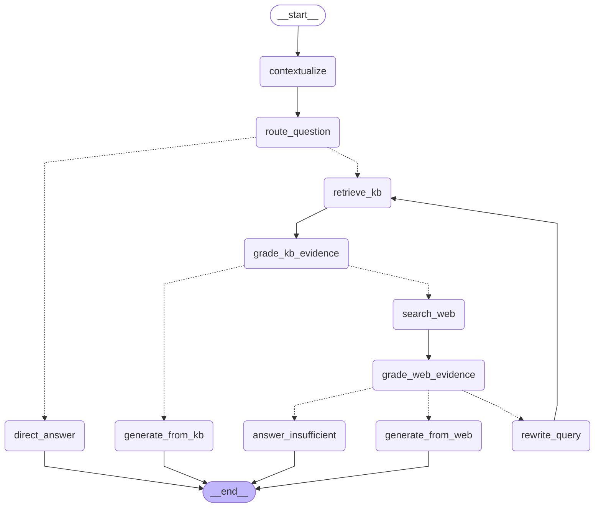

# Agent graph

Generated from the compiled graph by `python scripts/render_graph.py`. Do not edit by hand.

Solid arrows are unconditional edges; dotted arrows are branches taken on a structured decision.

